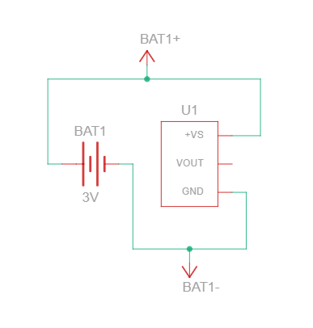
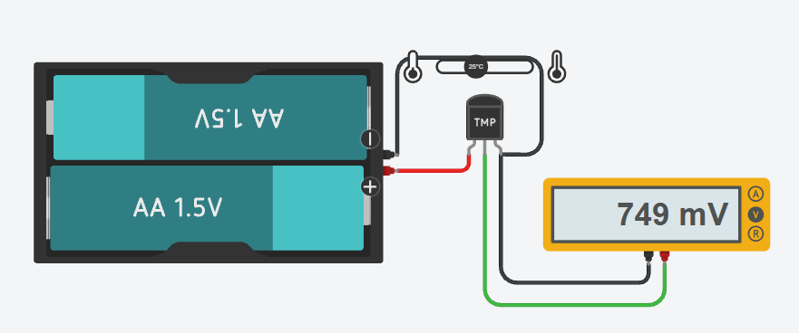
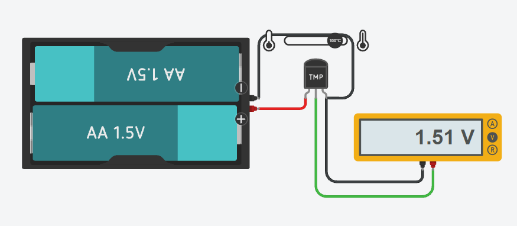
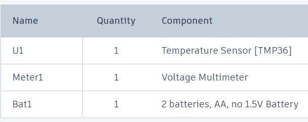

# Temperature Sensor

**TMP36 analog temperature sensing — characterising the voltage-to-temperature transfer function in Tinkercad**


---

## Project Overview

Before a temperature sensor can be read by a microcontroller, you have to know what its output voltage actually means.

This project takes a **TMP36** analog temperature sensor, powers it from a 3V battery pack, and measures its output directly with a multimeter at two known temperatures. No microcontroller, no code — just the sensor and a meter, verifying the datasheet transfer function by measurement.

It is deliberately the simplest possible version of the experiment, and it establishes the conversion equation used in every project that reads this sensor afterwards.

---

## Circuit Schematic

<p align="center">
  
</p>

The TMP36 is a three-pin device — **+VS**, **VOUT**, and **GND**. It needs no external components: no bias resistor, no linearisation network, no calibration circuit.

---

## Working Principle

The TMP36 outputs a voltage that rises linearly with temperature:

```
V_out = 0.5 V + (0.01 V/°C × T)

so:    T(°C) = (V_out − 0.5) / 0.01
```

The 500 mV offset exists so that sub-zero temperatures still produce a positive output voltage, which means the sensor can be read by a single-supply ADC without any negative rail.

---

## Simulation Results

The sensor was measured at two known temperatures to verify the transfer function.

### At 25°C

<p align="center">
  
</p>

### At 100°C

<p align="center">
  
</p>

### Verification

| Temperature | Expected output | Measured output | Temperature back-calculated |
|-------------|-----------------|-----------------|------------------------------|
| 25°C | 750 mV | **749 mV** | 24.9°C |
| 100°C | 1500 mV | **1.51 V** | 101°C |

Both points sit on the predicted line, confirming the 10 mV/°C slope and the 500 mV offset across a 75°C span.

---

## Components Used

<p align="center">
  
</p>

| Ref | Qty | Component |
|-----|-----|-----------|
| U1 | 1 | TMP36 temperature sensor |
| Bat1 | 1 | 2 × AA (3V supply) |
| Meter1 | 1 | Voltage multimeter |

---

## Tinkercad Simulation

🔗 **[Open the Temperature Sensor simulation on Tinkercad](https://www.tinkercad.com/things/7GyZF4XJoh6-temperature-sensor)**

---

## Software Used

- **Tinkercad Circuits** — schematic capture and simulation

---

## Next Version

**[Temperature Sensor 2.0](../Temperature-Sensor-2.0)** builds on this, adding an on-board regulated supply and an LED indicator so the temperature state is visible without a meter.

---

## Future Improvements

- Read the output with an ADC and convert to °C in firmware
- Display the temperature on an LCD instead of a multimeter
- Add more calibration points to check linearity across the full −40°C to +125°C range
- Average multiple samples to reduce noise on the reading
- Add a threshold output that triggers a fan or alarm above a set temperature

---

## Repository Structure

```
Temperature-Sensor/
├── README.md
└── Images/
    ├── circuit-schematic.png
    ├── reading-25c.png
    ├── reading-100c.png
    └── components-list.png
```

---

## Author

**Md Kaif**

📧 p0409athan@gmail.com

---

<p align="center">Built as part of an electronics and embedded systems portfolio.</p>
